<picture>
  <source media="(prefers-color-scheme: dark)" srcset="./dark.svg">
  <source media="(prefers-color-scheme: light)" srcset="./light.svg">
  
</picture>

### Research Engineer · AI R&D · Full-Stack Engineering

**From data and models to dependable AI services.**  
자연어와 비전 연구를 데이터·AI·웹 엔지니어링으로 연결하여 실제 서비스를 구축합니다.

  

---

## Hello, I’m Moon 👋

I’m a **Research Engineer at DaekyoCNS R&D Center**, responsible for AI research and development across **Tugboat, Luxplorer, and NexVi**.

자연어와 컴퓨터 비전을 포함한 ML·DL 알고리즘을 연구·개발하고, 데이터 파이프라인과 AI 모델부터 웹 애플리케이션까지 연결하여 실제 서비스를 구축합니다. 모델의 정확도뿐 아니라 **데이터가 어떻게 만들어지는지**, **실험이 다시 재현되는지**, **결과가 업무 흐름 안에서 안정적으로 사용되는지**를 중요하게 생각합니다.

> **Clarity before complexity. Evidence before confidence. Reliability before scale.**

## What I Build

| 🧪 ML/DL Research | 🧠 AI Engineering | 🧩 Full-Stack Delivery |
|:--|:--|:--|
| Natural language, computer vision, and multimodal algorithms for real-world problems | Data pipelines, model training and evaluation, inference systems, and application integration | APIs, web services, deployment, observability, and maintainable product delivery |

## Product & Solution R&D

| Solution | Product focus | My contribution |
|:--|:--|:--|
| [**Tugboat**](https://www.daekyocns.com/business/solution.aspx) | AI concentration and affective-intelligence data for smart learning care | ML/DL research, model engineering, and AI service development |
| [**Luxplorer**](https://www.daekyocns.com/business/solution.aspx) | Audio-visual multimodal lip-reading and pronunciation analysis | Natural-language, vision, and multimodal model R&D with service integration |
| [**NexVi**](https://www.daekyocns.com/business/solution.aspx) | Vision AI for industrial defect and anomaly detection | Data engineering, vision-model development, and end-to-end service construction |

Product descriptions follow the public <a href="https://www.daekyocns.com/business/solution.aspx">DaekyoCNS Solutions</a> page. Internal architecture, customer data, and confidential implementation details are intentionally excluded.

## Featured Achievement 🏆

### 2025 AI Champion Competition — AI Challenger · 3rd Place

**Minister of Science and ICT Award · Team Revivo**  
과학기술정보통신부가 주최한 2025 AI Champion 대회에서 차량 외관 미세 파손 검출을 포함한 **모듈형 스캐닝 기반 지능형 모빌리티 외부 상태 진단 시스템**으로 AI Challenger상(3위)을 수상했습니다.

- **Team** — Revivo · DaekyoCNS × GURUGEN × WPDR
- **Challenge** — 저가형 센서와 AI 분석을 결합한 차량 외관·하부·타이어 통합 진단 자동화
- **My role** — 데이터 엔지니어링, AI 엔지니어링, 웹 서비스 개발을 모두 주도한 메인 풀스택 엔지니어
- **Ownership** — 데이터 구성과 처리부터 모델 개발·추론, 서비스 연동과 웹 구현까지 end-to-end 수행
- **Recognition** — AI Challenger · 3rd Place · Minister of Science and ICT Award

[Official award result →](https://www.msit.go.kr/eng/bbs/view.do?bbsSeqNo=42&mId=4&mPid=2&nttSeqNo=1188&sCode=eng) · [Press coverage →](https://www.etnews.com/20251113000202)

## Current Focus

- **Reliable Vision AI** — 실제 환경의 노이즈와 변화까지 고려한 인식 시스템
- **Multimodal Intelligence** — 영상·음성·언어 정보를 함께 다루는 모델과 파이프라인
- **LLM-enabled Workflows** — 명확한 책임 경계와 검증 단계를 가진 AI 업무 자동화
- **Research to Production** — 데이터·모델·API·웹 서비스·운영으로 이어지는 end-to-end 엔지니어링

## Selected Public Work

| Project | What it demonstrates |
|:--|:--|
| [**AI Blood Viscometer**](https://github.com/dk-moon/Blood_Viscometer) | Time-series sensing, deep-learning ensembles, real-time inference, and Docker delivery |
| [**Furnace Internal Simulator**](https://github.com/dk-moon/Furnace_Simulator) | Object detection and regression applied to an industrial heat-treatment problem |
| [**Azure Kinect Data Collection Tool**](https://github.com/dk-moon/Azure_Kinect_DK_Real-time_Data_Collection_Tool) | Multi-device capture, body tracking, calibration data, and COCO annotation generation |

Public projects are maintained in my personal research archive. Company and client-confidential work is intentionally not described here.

## Engineering Toolkit

| Area | Tools |
|:--|:--|
| **AI & Data** | Python · PyTorch · TensorFlow · OpenCV · Pandas |
| **Applications** | Java · Spring Boot · C# · WPF · REST API · Web services |
| **Delivery** | Docker · Azure · AWS · GitHub Actions · Git |
| **AI Integration** | OpenAI API · RAG · Structured Outputs · Workflow orchestration |

      

## How I Work

1. **Frame** — 문제, 사용자, 실패 조건을 먼저 정의합니다.
2. **Prototype** — 가장 작은 실험으로 핵심 가설을 검증합니다.
3. **Measure** — 재현 가능한 기준으로 성능과 한계를 함께 기록합니다.
4. **Ship** — 단순한 인터페이스, 관측 가능성, 유지보수성을 갖춰 전달합니다.
5. **Learn** — 운영 피드백을 다음 실험과 설계에 반영합니다.

## Contribution Garden 🌱

  
   
  Live 12-month contribution calendar · GitHub’s native contribution section below is the source of truth.

<b>🐍 A tiny maintainer lives in this garden</b>

 
<picture>
  <source media="(prefers-color-scheme: dark)" srcset="https://raw.githubusercontent.com/Moon-Dongkyu/Moon-Dongkyu/output/github-contribution-grid-snake-dark.svg">
  <source media="(prefers-color-scheme: light)" srcset="https://raw.githubusercontent.com/Moon-Dongkyu/Moon-Dongkyu/output/github-contribution-grid-snake.svg">
  
</picture>

## Contact

| | |
|:--|:--|
| **Company** | DaekyoCNS R&D Center |
| **Position** | Research Engineer |
| **Tel** | +82 2 829 0810 |
| **E-Mail** | [dongkyu_moon@daekyo.co.kr](mailto:dongkyu_moon@daekyo.co.kr) |

---

**Research deeply. Engineer end-to-end. Deliver measurable impact.** ☁️

